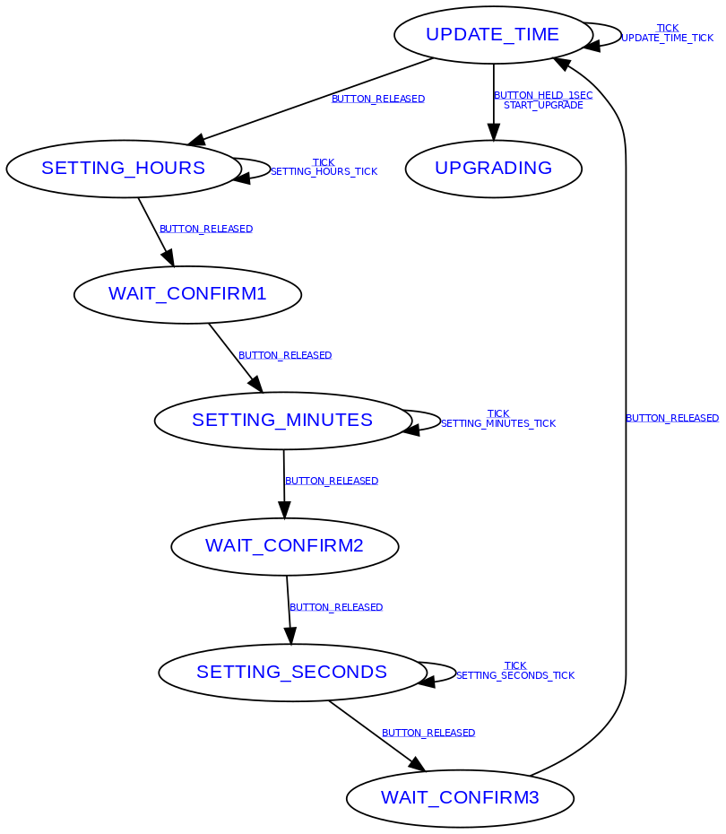

# Setup

```sh
sudo apt install \
    cmake \
    gcc-arm-none-eabi \
    libnewlib-arm-none-eabi \
    libstdc++-arm-none-eabi-newlib

git submodule update --init --recursive
```

# Branches

There are various different git branches each supporting a different type of clock that can run on
the same 8x8 LED matrix.  The type of clock should be inferred from the name of the branch.

# Build SDK, picotool, and bcd-clock
```sh
./build.sh
```

# Quick rebuild of just bcd-clock

```sh
cmake --preset breadboard
cmake --build build
```

or 

```sh
cmake --preset display-module
cmake --build build
```

# Installation

First time:

* Disconnect USB
* Hold down bootsel
* Connect USB
* Release bootesl
* Copy `build/src/bcd_clock.uf2` to new USB storage device

Later times:

* Make sure it is in the UPDATE_TIME state (i.e. time is changing every second)
* Hold down bootsel for > 1 second
* Copy `build/src/bcd_clock.uf2` to new USB storage device

# Debug

Start picocom

```sh
picocom -b 115200 /dev/ttyACM0
```

Try pressing a few buttons to get output

```
Event: BUTTON_RELEASED
State change: UPDATE_TIME -> SETTING_HOURS
Event: BUTTON_RELEASED
State change: SETTING_HOURS -> WAIT_CONFIRM1
Event: BUTTON_RELEASED
State change: WAIT_CONFIRM1 -> SETTING_MINUTES
Event: BUTTON_RELEASED
State change: SETTING_MINUTES -> WAIT_CONFIRM2
Event: BUTTON_RELEASED
State change: WAIT_CONFIRM2 -> SETTING_SECONDS
Event: BUTTON_RELEASED
State change: SETTING_SECONDS -> WAIT_CONFIRM3
Event: BUTTON_RELEASED
State change: WAIT_CONFIRM3 -> UPDATE_TIME
```

Exit with `C-a C-x`

# Design

## Software

(Created with `lib/fsm/tools/gen_graph -i src/MainFsmTable.h -c MainFsmTable -o docs/MainFsmTable.png`)



## Hardware

### Inventory (breadboard)

Bought from pihut.com


### Inventory (display-module)

Bought from www.az-delivery.de


### Schematic (breadboard)


### Schematic (display-module)


