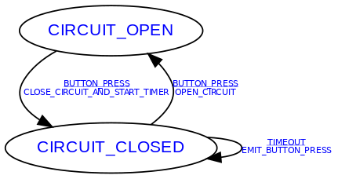

# Building the example fsm

```sh
cd example/
cmake -S . -B build
cd build/
make
```

# Running the example fsm
```sh
./example/build/example
```

# Rebuilding the output PNG
```sh
cd example/
../tools/gen_graph -i ExampleFsmTable.h -c ExampleFsmTable -o ExampleFsm.png
```

This should produce an image file like this


